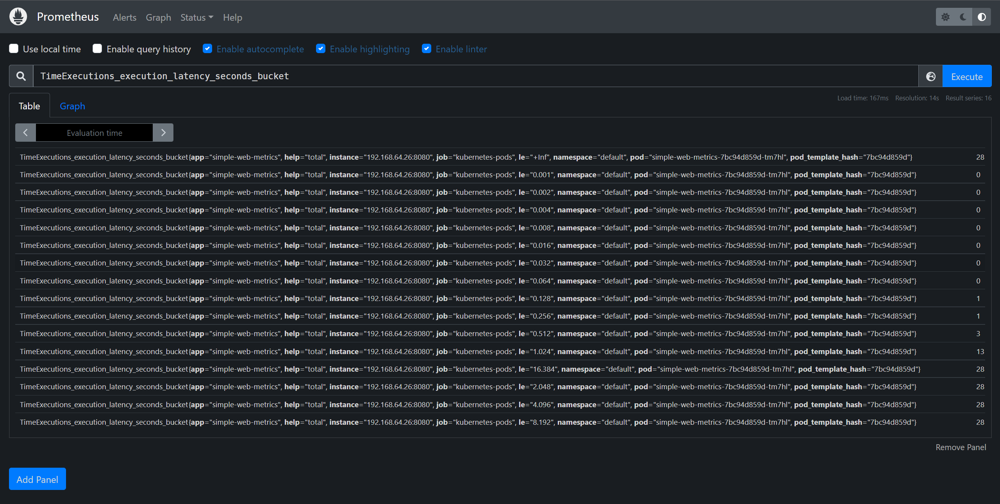

```shell
# 编译镜像
make release

# 部署 simple-web
kubectl apply -f deployment/deployment.deployment
# ---
# deployment.apps/simple-web-metrics created
# ---
kubectl get po -owide
# ---
# NAME                                            READY   STATUS    RESTARTS        AGE     IP              NODE      NOMINATED NODE   READINESS GATES
# ...
# simple-web-metrics-8558df6586-n5xmg             1/1     Running   0               18s     192.168.64.26   jrx-gcp   <none>           <none>

# 测试访问
curl 192.168.64.26:8080/simple-web/healthz
# ---
# "activating"

# 多次访问随机延时接口
curl 192.168.64.26:8080/simple-web/time

# 访问指标接口查看数据
curl 192.168.64.26:8080/metrics
# ...
# TimeExecutions_execution_latency_seconds_bucket{help="total",le="0.001"} 0
# TimeExecutions_execution_latency_seconds_bucket{help="total",le="0.002"} 0
# TimeExecutions_execution_latency_seconds_bucket{help="total",le="0.004"} 0
# TimeExecutions_execution_latency_seconds_bucket{help="total",le="0.008"} 0
# TimeExecutions_execution_latency_seconds_bucket{help="total",le="0.016"} 0
# TimeExecutions_execution_latency_seconds_bucket{help="total",le="0.032"} 0
# TimeExecutions_execution_latency_seconds_bucket{help="total",le="0.064"} 0
# TimeExecutions_execution_latency_seconds_bucket{help="total",le="0.128"} 0
# TimeExecutions_execution_latency_seconds_bucket{help="total",le="0.256"} 0
# TimeExecutions_execution_latency_seconds_bucket{help="total",le="0.512"} 0
# TimeExecutions_execution_latency_seconds_bucket{help="total",le="1.024"} 2
# TimeExecutions_execution_latency_seconds_bucket{help="total",le="2.048"} 6
# TimeExecutions_execution_latency_seconds_bucket{help="total",le="4.096"} 6
# TimeExecutions_execution_latency_seconds_bucket{help="total",le="8.192"} 6
# TimeExecutions_execution_latency_seconds_bucket{help="total",le="16.384"} 6
# TimeExecutions_execution_latency_seconds_bucket{help="total",le="+Inf"} 6
# TimeExecutions_execution_latency_seconds_sum{help="total"} 7.780859219
# TimeExecutions_execution_latency_seconds_count{help="total"} 6

# 进入 prometheus 界面查看数据
# 如下图1
```
- 图 1
