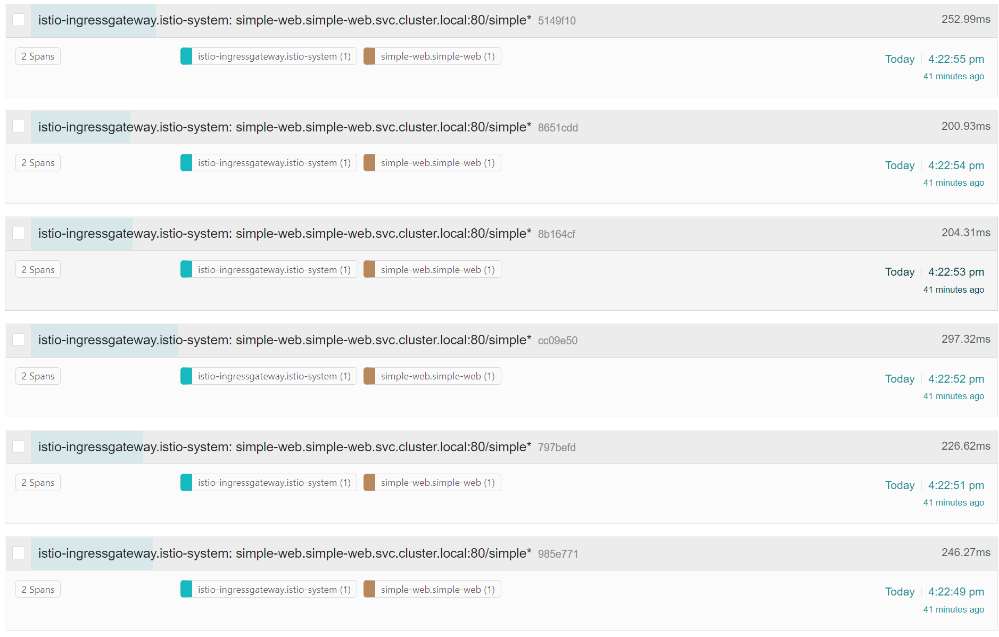
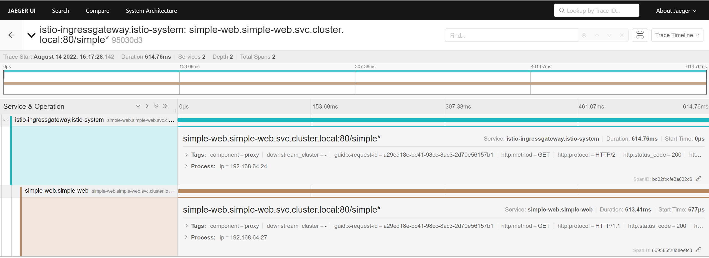

* 修改`simple-vs.yaml`，调整路由

  ```powershell
  # 更新 virtual service
  kubectl -nsimple-web apply -f simple-vs-prefix.yaml
  # ---
  # virtualservice.networking.istio.io/simple-vs configured

  # 测试链接
  curl --resolve simple.jrx.io:443:$INGRESS_IP https://simple.jrx.io/simple/time -v -k
  # ...
  # * Connection #0 to host simple.jrx.io left intact
  # "ok, TimeController"#
  ```

* 访问 JAEJER UI 查看 simple-web 链路信息

