#### 极客时间云原生训练营总结

15周的训练营学习下来，对云原生技术栈有了较为清晰的认识，在这里做个简单的总结

---

#### Golang 相关知识

* Go 语言的内存分配：

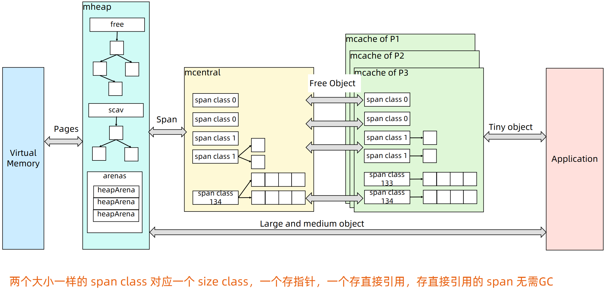

* **mcache**：小对象的内存直接分配区域

    * `size class`从1到66，每个`size class`两个`span`；
    * `span`大小是`8KB`，按`span class`大小切分。
* **mcentral**

    * 每个`span class`维护了两个链表（`non empty`和`empty`），当`mcache`向`mcentral`申请内存时，先从`non empty`中查找，查找不到再从`empty`中查找。
    * `span`内的所有内存块都被占用时，没有剩余空间继续分配对象，`mcache`会向`mcentral`申请1个`span`，`mcache`拿到`span`后继续分配对象；
    * 当`mcentral`向`mcache`提供`span`时，如果没有符合条件的`span`，`mcentral`会向`mheap`申请`span`。
* **mheap**

    * 当`mheap`没有足够的内存时，`mheap`会向`Virtual Memory`申请内存；
    * `Mheap`把`span`组织成了**树结构（排序二叉树）**，而不是链表；

        * **free**：刚从`Virtual Memory`申请过来的内存；
        * **scav**：`gc`回来的`page`会维护在`scav`中。
    * 然后把`span`分配到`heapArena`进行管理，它包含**地址映射**和`span`**是否包含指针等位图**，为了更高效的分配、回收和再利用内存。
* GMP 调度模型

  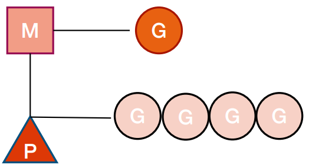

    * **G（goroutine）**：每个`goroutine`都有自己的栈空间、定时器，初始化的栈空间在2k左右，空间会随着需求增长；
    * **M（Machine）**：抽象化代表**内核线程**，记录内核线程栈信息，当`goroutine`调度到线程时，使用该`goroutine`自己的栈信息；
    * **P（Processer）**：调度器，负责调度goroutine，维护一个本地`goroutine`队列，M从P获得`goroutine`并执行，同时还负责部分内存的管理。
    * **GMP对应关系：**
      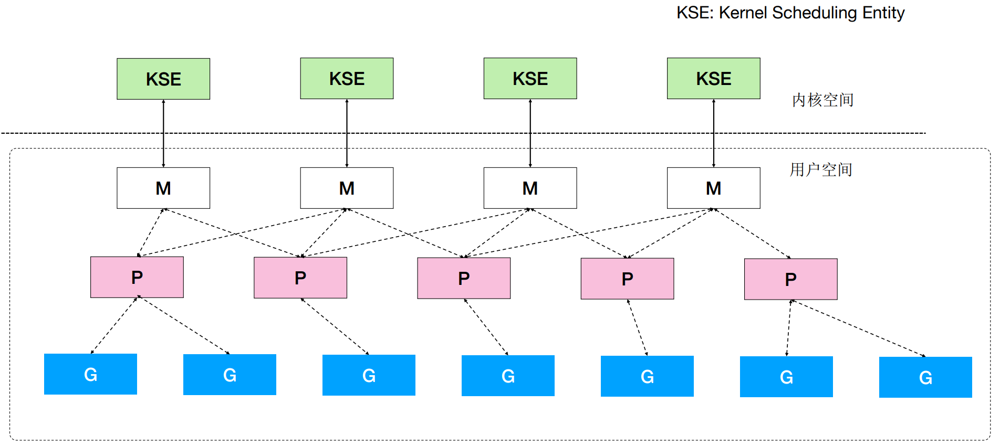

        * **KSE**：内核态可调度单位
    * **GMP调度细节**
      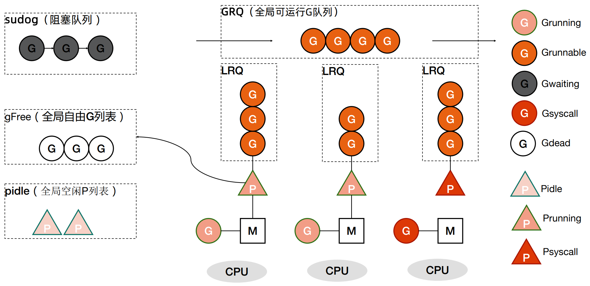

        * 主程序启动时通过`GOMAXPROCS`参数设置最大并发数量（即P的数量），默认为当前节点CPU核心数量；
        * `main`方法首先会挂到某一个P上，P会与某一个M绑定，同时M执行`main`方法；

        * `main`方法中开启的goroutine同样会被到相同的P的执行队列是上；
        * P在调度时，会先从本地的`LRQ`查找可执行的goroutine（runnext），如果没有则去`GRQ`查找，同样没有则会去其他P的`LRQ`查找（通过`runtime.runqsteal`），若有则截取一半放到自己的`LRQ`中；
        * 当所有P的`LRQ`已满（**默认上限256**）的情况下再创建的goroutine会被放入`GRQ`中（通过`runtime.runqputslow`）；
        * **如果G被阻塞在某个channel操作或网络I/O操作上时**，则会被放置到`sudog`队列中，M会尝试执行下一个可运行的G，如果这个P的`LRQ`中没有可运行的G则M会与P解绑进入挂起状态。`sudog`中G被唤醒标记为可运行时会被放入某个P的`LRQ`中被绑定的M继续执行；
        * **如果G被阻塞再某个系统调用上时**，那么执行这个G的M也会解绑P，与G一起进入挂起状态。此时P会寻找其他空闲的M进行绑定继续执行`LRQ`中的G。如果没有空闲的M但仍有其他G需要执行，go运行时则会创建一个新的M。当系统调用返回后阻塞的G会尝试获取一个可用的P，如果没有G则会被标记为可运行，挂起的M也会再次进入挂起状态；
        * 当G执行完成则会放入`gFree`中等待复用；
    * **P的状态机**
      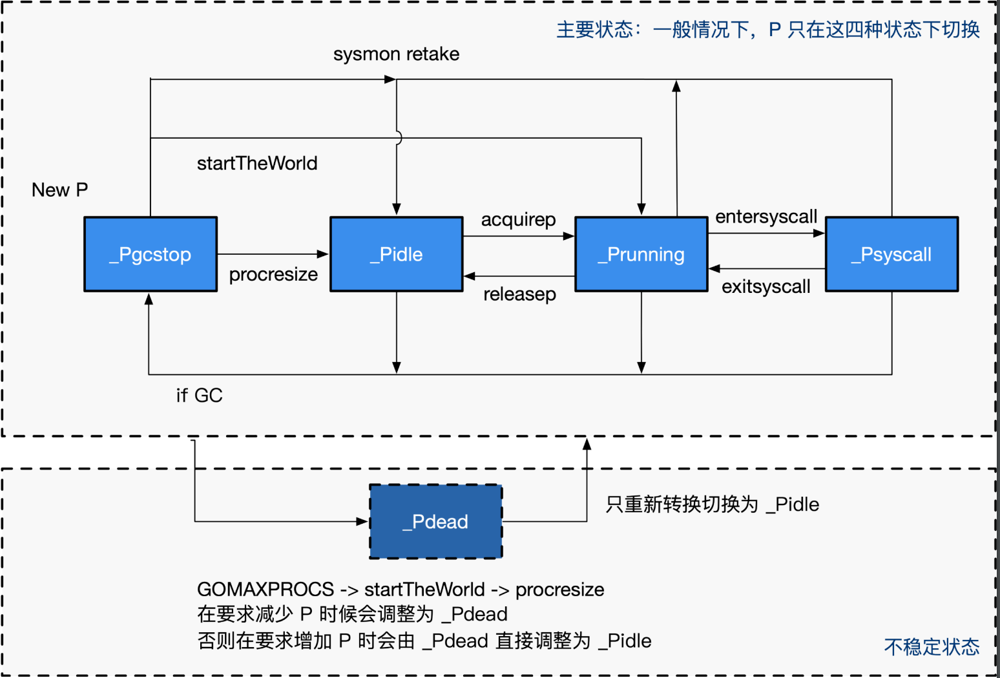

        * **_Pidle**：处理器没有运行用户代码或者调度器，被空闲队列或者改变其状态的结构持有，运行队列为空；
        * **_Prunning**：被线程M持有，并且正在执行用户代码或者调度器；
        * **_Psyscall**：没有执行用户代码，当前线程陷入系统调用；
        * **_Pgcstop**：被线程M持有，当前处理器由于垃圾回收被停止；
        * **_Pdead**：当前处理器已经不被使用。
    * **G的状态机**
      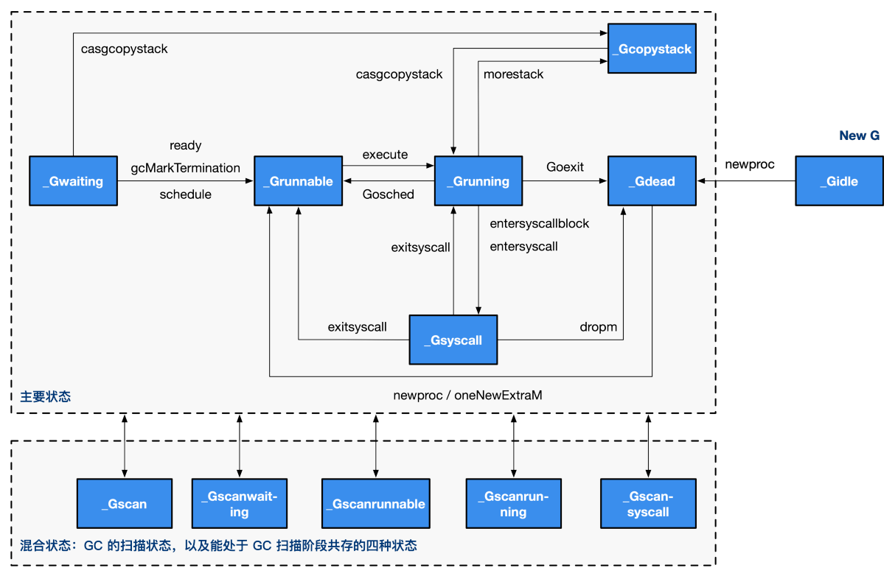

        * **_Gidle**：刚刚被分配并且还没有被初始化，值为0，为创建goroutine后的默认值；
        * **_Grunnable**： 没有执行代码，没有栈的所有权，存储在运行队列中，可能在某个P的本地队列或全局队列中；
        * **_Grunning**： 正在执行代码的goroutine，拥有栈的所有权；
        * **_Gsyscall**：正在执行系统调用，拥有栈的所有权，与P脱离，但是与某个M绑定，会在调用结束后被分配到运行队列；
        * **_Gwaiting**：被阻塞的goroutine，阻塞在某个channel的发送或者接收队列；
        * **_Gdead**： 当前goroutine未被使用，没有执行代码，可能有分配的栈，分布在空闲列表gFree，可能是一个刚刚初始化的goroutine，也可能是执行了goexit退出的goroutine；
        * **_Gcopystac**：栈正在被拷贝，没有执行代码，不在运行队列上，执行权在；
        * **_Gscan** ： GC正在扫描栈空间，没有执行代码，可以与其他状态同时存在。

    * **G的创建过程**

        * 获取（从`gFree`中）或创建（通过`runtime.malg`）新的goroutine结构体；
        * 将函数入参移到goroutine的栈上；
        * 更新goroutine调度相关的属性，更新状态为`_Grunnable`;
        * 返回的goroutine会存储到全局变量`allgs`中。
    * **调度器行为**

        * 为了保证公平，当全局运行队列中有待执行的goroutine时，通过`schedtick`保证有**一定几率(1/61)会从全局的运行队列中**查找对应的goroutine；
        * 从`LRQ`查找待执行的goroutine；
        * 如果前两种方法都没有找到goroutine，会通过`runtime.findrunnable`进行阻塞地查找goroutine；

            * 从`LRQ`、`GRQ`查找；
            * 从网络轮询器中查找是否有goroutine等待运行；
            * 通过`runtime.runqsteal`尝试从其他随机的处理器中窃取一半待运行的goroutine。

---

#### Kubernetes
* 基础架构及核心组件

  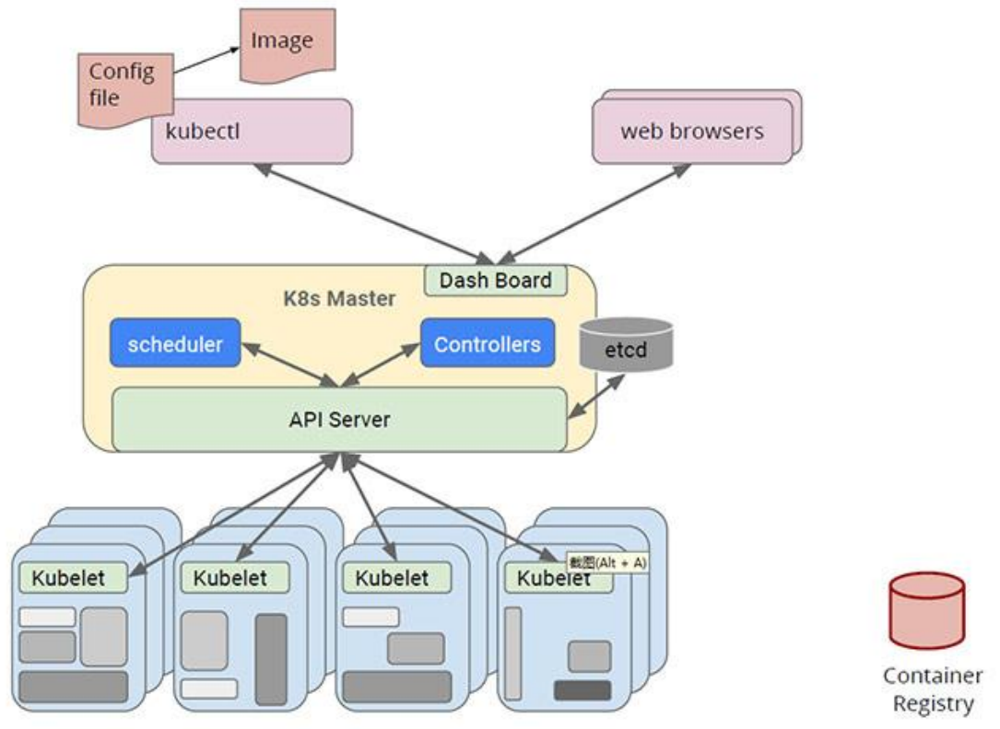

    * `Kubernetes Master Node`核心组件： 

        * `kube-apiserver`：`Kubernetes`控制面板中唯一带有**用户可访问**`API`以及**用户可交互**的组件，`API Server`会暴露一个`RESTful`的`Kubernetes API`并使用`JSON`格式的**清单文件**（`manifest files`）；
        * `Cluster Data Store`：`Kubernetes`使用`etcd`（一个强大、稳定、高可用的键值存储）作为`API`对象的存储数据库；
        * `Controller Manager`：即`kube-controller manager`，运行着所有集群日常任务的控制器，包括了**节点控制器**、**副本控制器**、**端点**（`endpoint`）**控制器**以及**服务账户**等；
        * `Scheduler`：调度器会监控新建的`pods`（一组或一个容器）并将其分配给节点。
    * `Kubernetes Worker Node`核心组件：

        * `kubelet`：负责调度到对应节点的`Pod`的生命周期管理，执行任务并将`Pod`状态报告给`Master Node`的渠道，通过容器运行时（拉取镜像、启动和停止容器等）来运行这些容器，定期执行被请求的容器的健康探测程序；
        * `kube-proxy`：负责节点的网络，在主机上维护网络规则并执行连接转发，同时负责对正在服务的`Pod`进行负载均衡。

* etcd

  `etcd`是CoreOS基于`Raft`开发的分布式`key-value`存储，可用于服务发现、共享配置以及一致性保障（如数据库选主、分布式锁等）。
  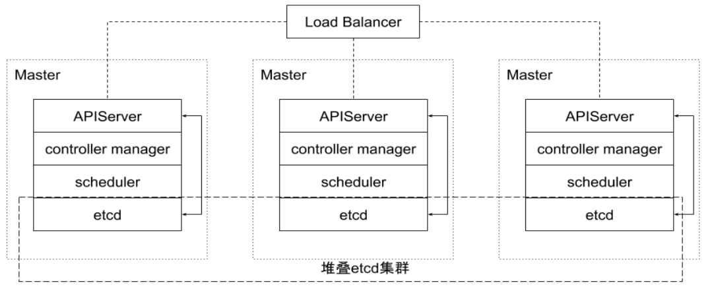

    * 基本的`key-value`存储；
    * 监听机制；
    * `key`的过期及续约机制，用于监控和服务发现；
    * 原子`CAS`和`CAD`，用于分布式锁和leader选举。

* 核心对象

    * `Node`

        * 对应集群内计算节点，`Pod`真正运行的主机，可以**物理机**也可以是**虚拟机**；
        * 为了管理`Pod`，每个`Node`节点上至少要运行`container runtime`（例如`Docker`、`containerd`、`cri-o`）、`kubelet`和`kube-proxy`服务；
        * `Node`属于`core group`（`core group`内对象`group`信息为空）；
        * 通过命令`kubectl get no`查看集群`Node`对象信息；
    * `Namespace`

        * 一组资源和对象的抽象集合；
        * 常见的`Pod`、`Service`、`Replication`、`Controller`、`Deployment`都是属于某一个`Namespace`的（默认是`default`）；
        * `Node`、`PersistentVolume`则不属于任何`Namespace`（即`nonNamespace`对象）；
        * `Namespace`本身也是一个`nonNamespace`对象；
        * 通过命令`kubectl get ns`查看集群`Namespace`对象信息。

    * `Pod`
      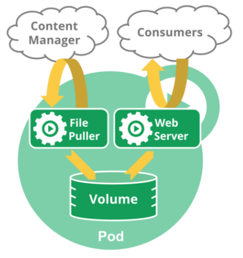

        * `Kubernetes`**调度的基本单位**；
        * 一组紧密关联的**容器集合**，他们共享`PID/IPC/Network/UTS Namespace`；
        * `Pod`的设计理念是支持**多个容器**在同一个`Pod`中共享网络和文件系统，可以通过进程间通信和文件共享这种简单高效的方式组合完成服务；
        * 同一个`Pod`中的不同容器可以共享的资源：

            * `Network Namespace`；
            * 可以通过挂载存储卷共享存储；
            * 共享`Security Context`。
    * `ConfigMap`

        * 用来将**非机密性**的数据保存到**键值对**中；
        * 使用时，`Pod`可以将其用作环境变量、命令行参数或者存储卷中的配置文件；
        * 将环境配置信息和容器镜像解耦，便于应用配置修改。
        * ((20220817104445-3x1cvk9 '练习：configmap'))

    * `Secret`：用来保存和传递密码、密钥、认证凭证等**敏感信息**的对象；
    * `User Account & Service Account`

        * `User Account`为人提供账户标识，而`Service Account`为计算机进程和`Kubernetes`中运行的`Pod`提供账户标识；
        * `User Account`**和**`Service Account`**的一个区别是作用范围**：

            * `User Account`对应的是**人的身份**，与服务的`Namespace`无关，所以用户账户是跨`Namespace`；
            * `Service Account`对应的是一个**运行中的程序的身份**，与特定`Namespace`是相关的。

                * `Pod`启动时`Kubernetes`会默认给`Pod`分配一个`Service Account`并通过`VolumeMounts`将`Service Account` `Mount`到`/var/run/secrets/kubernetes.io/serviceaccount`下，`Pod`通过读取其中的`token`和`ca`来与`apiserver`进行通信。
    * `Service`
      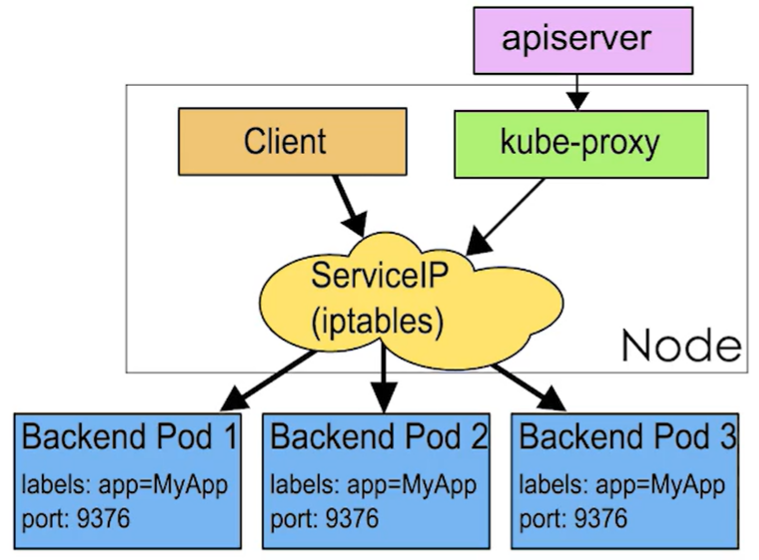

      `Service`是应用服务的抽象，通过`labels`为服务提供负载均衡和服务发现。
      匹配`labels`的`Pod IP`和**端口列表**组成`endpoints`，由`kube-proxy`负责将服务`IP`负载均衡到这些`endpoints`上。
      每个`Service`都会自动分配一个`clusterIP`（仅在集群内部可访问的虚拟地址）和`DNS`名，其他容器可以通过该地址或`DNS`来访问服务，而不需要了解后端的容器运行。

    * `ReplicaSet`

        * `Pod`只是**单个应用实例**的抽象，要构建高可用应用，通常需要构建多个同样的副本，提供同一个服务；
        * `ReplicaSet`允许用户定义`Pod`的副本数，每一个`Pod`都会被当作一个**无状态**的成员进行管理，`Kubernetes`保证总是有**用户期望的数量**的`Pod`正常运行；
        * 当某个副本宕机以后，`Controller`会创建一个新的副本；
        * 当因业务发生变更而需要调整扩缩容时，可以方便的调整副本的数量。
    * `Deployment`
      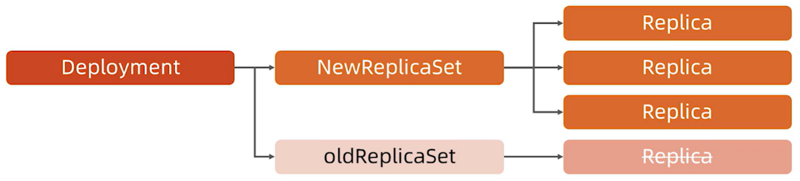

        * 表示用户对`Kubernetes`集群的一次更新操作；
        * `Deployment`是一个比`ReplicaSet`应用模式更广的`API`对象。可以是**创建/更新/滚动升级**一个服务；
        * 滚动升级实际上是创建一个新的`ReplicaSet`，然后逐渐将新`ReplicaSet`中的副本数增加到理想状态，将旧`ReplicaSet`中的副本数减小到`0`的符合操作；

            * `Deployment Controller`会计算`Deployment`内`template`的`hash`，以`hash`作为更新依据。
        * 以`Kubernetes`的发展方向，未来对所有长期伺服型的业务的管理都会通过`Department`来管理。

    * `StatefulSet`
      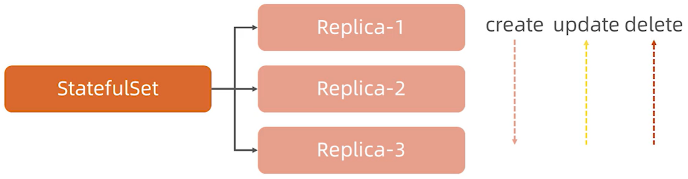

        * 对于`StatefulSet`中的`Pod`，每个`Pod`挂载都有**独立的存储**，如果一个`Pod`出现故障，从其他节点启动一个同样名字的`Pod`，要挂载上**原来**`Pod`**的存储**继续以它的状态提供服务；
        * 适合于****`StatefulSet`****业务包括数据库服务（例如`MySql`）、集群化管理服务（例如`Zookeeper`、`etcd`）等有状态服务；
        * 使用`StatefulSet`，`Pod`仍然可以通过漂移到不同节点提供高可用，而存储也可以通过外挂的存储来提供要可靠性，`StatefulSet`做的只是将确定的`Pod`与确定的存储关联起来保证**状态的连续性**。
        * **与**`Deployment`**的差异**

            * **身份表示**：`StatefulSet Controller`为每个`Pod`编号，序号从`0`开始，`Deployment`创建出来的`Pod`的名字是**随机的**；
            * **数据存储：**`StatefulSet`允许用户定义`volumeClaimTemplates`，`Pod`被创建的同时`Kubernetes`会以`volumeClaimTemplates`中定义的木本创建存储卷并`mount`给`Pod`；
            * **升级策略**：`Department`只支持**滚动升级**，`StatefulSet`除此之外还支持**分片升级**和`onDelete`。

    * `Job`

        * 用来控制**批处理型任务**的`API`对象；
        * `Job`管理的`Pod`根据用户的设置把任务成功完成后就自动退出；
        * 成功完成的标志根据不同的`spec.completions`策略而不同：

            * 单`Pod`型任务有一个`Pod`成功就标志完成；
            * 定数成功型任务保证有`N`个任务全部成功；
            * 工作队列型任务根据应用确认的全局成功而标志成功。

    * `DaemonSet`
      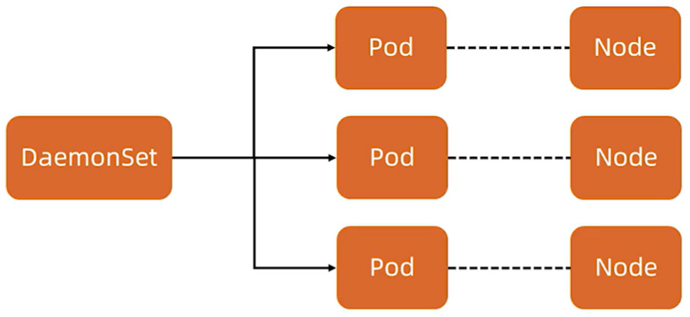

        * `DaemonSet`的核心关注点在`Kubernetes`集群中的节点（物理机或虚拟机），要保证每个节点上都有一个此类`Pod`运行；
        * 节点可能是所有集群节点也可能是通过`nodeSelector`选定的一些特定节点；
        * 典型的`DaemonSet`包括存储、日志和监控等在每个节点上支撑`Kubernetes`集群运行的服务。
    * `PV / PVC`

        * `PersistentVolume（PV）`是集群中的一块存储卷，可以由管理员手动设置，或当用户创建`PersistentVolumeClaim（PVC）`时根据`StorageClass`动态设置；
        * `PV`和`PVC`与`Pod`生命周期无关；
        * 对于不同的使用场景，用户通常需要不同属性（例如性能、访问模式等）的`PV`。
    * `CustomResourceDefinition`

        * `CRD`就像数据库的开放式表结构，允许用户自定义`Schema`以满足不同的业务需求；
        * 社区鼓励基于`CRD`的业务抽象，众多主流的扩展应用都是基于`CRD`构建的（例如`Istio`、`Knative`）；
        * 甚至基于`CRD`推出了`Operator Mode`和`Operator SDK`，可以以极低的成本开发定义新对象并构建新对象的控制器。
---
由于篇幅问题无法详细列举所学的各个知识点，
接下来的计划会继续在根据课程的知识点结合官方文档和对应源码深入理解，
多实践、多记录。